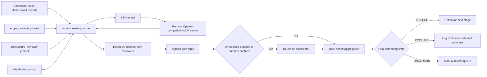

# Generative Foundation Models Bridging Text and Biological Data: A Scoping Review

Reproducible PRISMA-ScR literature review on generative foundation models that combine **text** (natural language or gene tokens) with **biological data** (any omics modality).

## Current Status

| Step | Status | Details |
|------|--------|---------|
| 0. Review of reviews | Done | `data/existing_reviews_compilation.md` |
| 1. Protocol | Done | `protocol/PRISMA_protocol.md`, `protocol/eligibility_criteria.md` |
| 2. Search queries (v3.1) | Done | `protocol/queries/`, `scripts/search_config.json` |
| 3. Search execution | Done | 7 databases, 2 rounds |
| 4. Deduplication | Done | `scripts/deduplicate.py` |
| 5. Abstract enrichment | Done | `scripts/enrich_abstracts.py` |
| 6. Title/Abstract screening | **In progress** | 4,027 records; criterion-by-criterion `LatteReview` workflow with local orchestration, remote `vLLM` serving, and a determinism-validated serving profile |

## Search Results

### v3.1 (2026-02-15) — initial search
- Date range: 2018-01-01 to 2026-02-28
- PubMed: 631, Scopus: 1,021, S2: 2,192, arXiv: 187, bioRxiv: 669, SN: 272, GS: 562
- Total: 5,534 → 3,555 unique (dedup) → 3,371 for screening (after enrichment + exclusion)

### Update (2026-04-14) — new publications
- Date range: 2026-03-01 to 2026-04-14
- PubMed: 46, Scopus: 32, S2: 201, arXiv: 14, bioRxiv: 5, SN: 33, GS: 536
- Total: 867 → 762 unique (internal dedup) → 668 new (cross-dedup with v3.1)
- Abstract enrichment: 29/41 enriched, 12 excluded
- **Combined: 3,371 + 668 − 12 = 4,027 records for screening**

## Repo Structure

```
protocol/           PRISMA protocol, eligibility criteria, search strategy
protocol/queries/   Database-specific search strings
scripts/
  reproduce_search.py       Reproducible search across 7 databases
  search_config.json        v3.1 search configuration
  search_config_update.json Update search configuration (Mar-Apr 2026)
  deduplicate.py            Conservative exact-match deduplication
  enrich_abstracts.py       Abstract enrichment via S2/CrossRef/PubMed APIs
data/
  deduplicated_records.json Master record set (4,027 records with abstracts)
  excluded_no_abstract.json Records excluded for missing abstracts
  exports/                  v3.0 database exports (2026-02-06)
  exports_v31/              v3.1 database exports (2026-02-15)
  exports_update/           Update exports (2026-04-14)
```

## Abstract Screening Process

The abstract-screening process is currently documented across these files:

- [`protocol/eligibility_criteria.md`](protocol/eligibility_criteria.md): formal IC/EC criteria and decision tree.
- [`protocol/screening_process.md`](protocol/screening_process.md): corpus preparation, enrichment, and screening-ready counts.
- [`protocol/llm_screening_system_guideline.md`](protocol/llm_screening_system_guideline.md): literature-backed design choice.
- [`protocol/lattereview_screening_architecture.md`](protocol/lattereview_screening_architecture.md): current `LatteReview` workflow shape.
- [`protocol/screening_prompt.md`](protocol/screening_prompt.md): current prompt stack index.

In practice we now treat:

- **BMC (Trad et al., 2025)** as the main source for screening behavior: criterion-by-criterion, `yes/no/unsure`, sensitivity-first.
- **PRISMA-trAIce (Holst et al., 2025)** as the outer reporting and audit layer.
- **Cochrane AI position statement (Flemyng et al., 2025)** as the validation and human-oversight gate.

## Current Screening Topology



Prompt documents for each stage:

- [`scope_reviewer`](protocol/screening_prompts/scope_reviewer_prompt.md)
- [`architecture_reviewer`](protocol/screening_prompts/architecture_reviewer_prompt.md)
- [`adjudicator`](protocol/screening_prompts/adjudicator_prompt.md)

Current implementation choices:

- round A uses two role-specialized reviewers rather than one global classifier;
- reviewers return criterion fields only, not a trusted one-shot final label;
- Python gate logic sits between round A and round B;
- round B only runs on unresolved criteria or criterion-level conflicts;
- final decision is aggregated from criterion fields rather than trusted as a free-form one-shot label;
- the operative requirement is a determinism-validated serving profile under the exact production stack, not commitment to any single model family;
- the current preferred development mode is local orchestration plus remote `vLLM` serving over SSH tunneling, rather than remote execution of the whole screening pipeline.

## Current Runtime Pattern

The current operational pattern is:

1. run `vllm serve` on euroHPC / Discoverer under `slurm`;
2. expose the model through an SSH tunnel to a local OpenAI-compatible endpoint;
3. run the `LatteReview` workflow locally;
4. keep screening logic, prompt iteration, and post-processing local;
5. use the cluster only as the GPU inference backend.

Why this pattern is preferred:

- it reduces friction from fragile remote shell sessions during development;
- it keeps the full screening logic under local version control and easy debugging;
- it preserves the same model-serving stack used for actual inference;
- it makes determinism checks easier because the orchestration layer is held constant locally.

Current evidence:

- a repeated 10-record local-via-tunnel pilot on the same validated serving profile returned an exact match across the two runs on all shared result columns.

The current workflow should therefore be understood as:

- **BMC-style criterion-by-criterion screening logic**
- **PRISMA-trAIce-style documentation and auditability**
- **Cochrane-style validation and human oversight**
- **local orchestration + remote GPU serving**

## Databases

| Database | API | Notes |
|----------|-----|-------|
| PubMed | NCBI Entrez | `[Title/Abstract]` field tags, `free full text[sb]` |
| Scopus | Elsevier Search API | `OPENACCESS(1)`, post-filter by date |
| Semantic Scholar | `/paper/search/bulk` | Boolean support, year filter |
| arXiv | arXiv API | Category filter, multi-query merge |
| bioRxiv/medRxiv | EuropePMC (`SRC:PPR`) | Full Boolean |
| SpringerNature | Meta + OA APIs | Full-text search → mandatory post-retrieval validation |
| Google Scholar | `scholarly` library | Rate-limited, supplementary source |

## Ground Truth Models

Must-find (11): scGPT, tGPT, LangCell, ChatCell, CellWhisperer, CellPLM, Nicheformer, EpiAgent, GenePT, GeneGPT, PathOmCLIP

All 11 found across combined databases in v3.1.

## Reproducibility

```bash
pip install requests scholarly
# Copy api_keys.template.json → api_keys.json and fill in your keys
python scripts/reproduce_search.py --keys api_keys.json --output-dir results/
python scripts/deduplicate.py --exports-dir results/
python scripts/enrich_abstracts.py --keys api_keys.json
```
