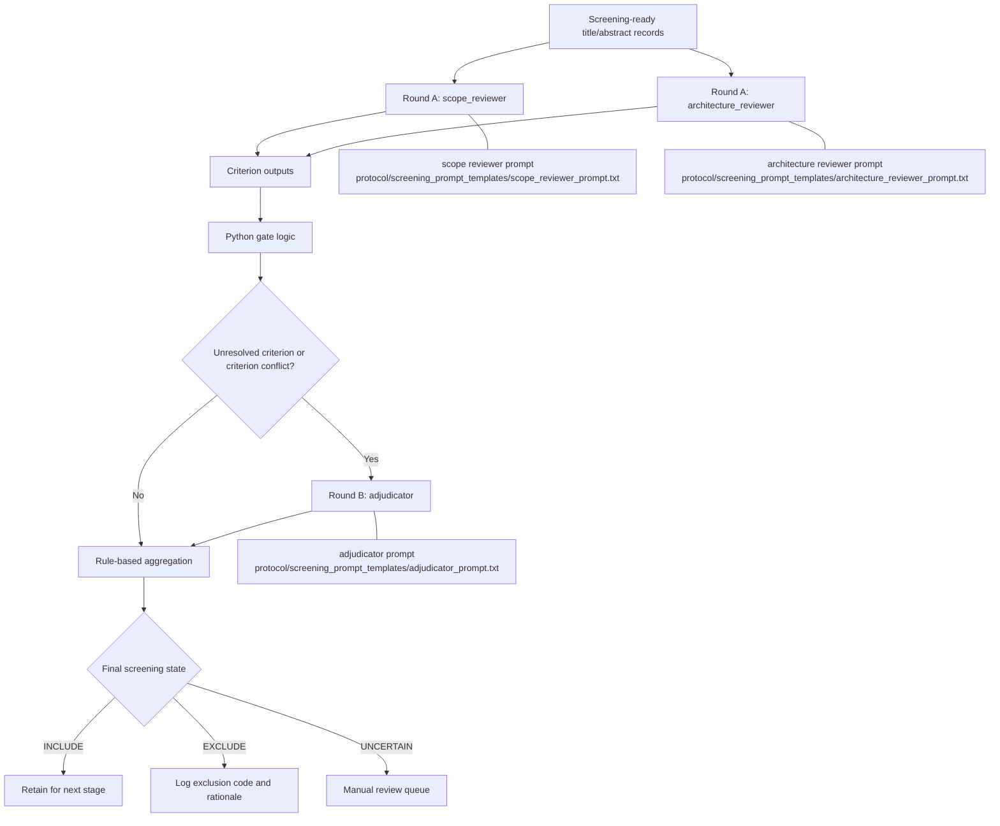

# Generative Foundation Models Bridging Text and Biological Data: A Scoping Review

Reproducible PRISMA-ScR literature review on generative foundation models that combine **text** (natural language or gene tokens) with **biological data** (any omics modality).

## Current Status

| Step | Status | Details |
|------|--------|---------|
| 0. Review of reviews | Done | `data/existing_reviews_compilation.md` |
| 1. Protocol | Done | `protocol/PRISMA_protocol.md`, `protocol/eligibility_criteria.md` |
| 2. Search queries (v3.1) | Done | `protocol/queries/`, `scripts/search_config.json` |
| 3. Search execution | Done | 7 databases, 4 rounds |
| 4. Deduplication | Done | `scripts/deduplicate.py` |
| 5. Abstract enrichment | Done | `scripts/enrich_abstracts.py` |
| 6. Title/Abstract screening | Done / living | Frozen role-separated Codex pipeline with retained per-role logs |
| 7. Full-text section screening | Done / living | Docling + Docling Graph selected-section pipeline |
| 8. Input-route taxonomy and atlas | Done / living | 55 records, 109 models, 586 grounded routes through 2026-08-09 |

For the next update, start with the canonical operational runbook:
[`protocol/LIVING_REVIEW_RUNBOOK.md`](protocol/LIVING_REVIEW_RUNBOOK.md).

## Minimal LatteReview Runtime

If you already have an OpenAI-compatible LLM endpoint running on the GPU server
(for example `vllm serve`), the repository now contains the minimum files
needed to run the current title/abstract screening pipeline directly from this
repo clone.

Minimal setup:

```bash
git clone https://github.com/BogdanDidenko/text-bio-fundational-models-review.git
cd text-bio-fundational-models-review
bash scripts/setup_lattereview_runtime.sh
```

Then run the pipeline against your served model:

```bash
python3 scripts/run_lattereview_guideline_pilot.py \
  --base-url http://127.0.0.1:8000/v1 \
  --model qwen3-30b-a3b \
  --input-csv /path/to/input.csv \
  --output-dir /path/to/output_dir
```

Expected input:

- a CSV with at least `title` and `abstract` columns
- template: [`data/screening_input_template.csv`](data/screening_input_template.csv)

Key runtime files:

- [`scripts/run_lattereview_guideline_pilot.py`](scripts/run_lattereview_guideline_pilot.py)
- [`scripts/setup_lattereview_runtime.sh`](scripts/setup_lattereview_runtime.sh)
- [`scripts/requirements_lattereview_pilot.txt`](scripts/requirements_lattereview_pilot.txt)
- [`protocol/screening_prompt_templates/`](protocol/screening_prompt_templates/)

This path assumes:

- the LLM endpoint is already running;
- you only need this repo for the screening logic, prompts, and aggregation.

## Search Results

### v3.1 (2026-02-15) — initial search
- Date range: 2018-01-01 to 2026-02-28
- PubMed: 631, Scopus: 1,021, S2: 2,192, arXiv: 187, bioRxiv: 669, SN: 272, GS: 562
- Total: 5,534 → 3,555 unique (dedup) → 3,371 for screening (after enrichment + exclusion)

### Update (2026-04-14) — new publications
- Date range: 2026-03-01 to 2026-04-14
- PubMed: 46, Scopus: 32, S2: 201, arXiv: 14, bioRxiv: 5, SN: 33, GS: 536
- Total: 867 → 762 unique (internal dedup) → 668 new (cross-dedup with v3.1)
- Abstract enrichment: 29/41 enriched, 12 excluded
- **Combined: 3,371 + 668 − 12 = 4,027 records for screening**

### Update (2026-06-10) — new publications
- Date range: 2026-04-15 to 2026-06-10
- PubMed: 68, Scopus: 39, S2: 215, arXiv: 21, bioRxiv/medRxiv: 33, SN: 27, GS: 530
- Total: 933 → 785 unique (internal dedup) → 447 new (cross-dedup with 4,027-record master)
- Crossref audit: 2 hidden duplicates removed; 126 DOI enrichments
- Final top-up screening-ready set: 431 records

### Update (2026-07-06) — new publications
- Date range: 2026-06-11 to 2026-07-06
- PubMed: 25, Scopus: 12, S2: 118, arXiv: 6, bioRxiv/medRxiv: 16, SN: 20, GS: 0
- Total: 197 → 155 unique (internal dedup) → 134 new (cross-dedup with 4,027-record master)
- Crossref audit: 0 hidden duplicates; 0 DOI enrichments
- Final top-up screening-ready set: 119 records
- Note: Google Scholar was fully rate-limited on this run and returned 0 records.

## Repo Structure

```
protocol/           PRISMA protocol, eligibility criteria, search strategy
protocol/queries/   Database-specific search strings
scripts/
  reproduce_search.py       Reproducible search across 7 databases
  search_config.json        v3.1 search configuration
  search_config_update.json Update search configuration (Mar-Apr 2026)
  search_config_update_2026-06-10.json June 2026 top-up configuration
  search_config_update_2026-07-06.json July 2026 top-up configuration
  deduplicate.py            Conservative exact-match deduplication
  enrich_abstracts.py       Abstract enrichment via S2/CrossRef/PubMed APIs
data/
  deduplicated_records.json Master record set (4,027 records with abstracts)
  excluded_no_abstract.json Records excluded for missing abstracts
  exports/                  v3.0 database exports (2026-02-06)
  exports_v31/              v3.1 database exports (2026-02-15)
  exports_update/           Update exports (2026-04-14)
  exports_update_2026-06-10/ Update exports (2026-06-10)
  exports_update_2026-07-06/ Update exports (2026-07-06)
  dedup_update_2026-06-10/  Dedup/cross-dedup artifacts for June update
  dedup_update_2026-07-06/  Dedup/cross-dedup artifacts for July update
```

## Abstract Screening Process

The operational **methodology documentation set** currently uses **exactly 8
files**.

These are the files that define the current screening method:

1. [`protocol/eligibility_criteria.md`](protocol/eligibility_criteria.md) — formal IC/EC criteria and decision tree
2. [`protocol/screening_process.md`](protocol/screening_process.md) — how those criteria are applied across phase 1 and phase 2
3. [`protocol/llm_screening_system_guideline.md`](protocol/llm_screening_system_guideline.md) — literature-backed system design choice
4. [`protocol/lattereview_screening_architecture.md`](protocol/lattereview_screening_architecture.md) — current `LatteReview` workflow shape
5. [`protocol/screening_prompt.md`](protocol/screening_prompt.md) — prompt-stack index and aggregation policy
6. [`protocol/screening_prompts/scope_reviewer_prompt.md`](protocol/screening_prompts/scope_reviewer_prompt.md) — round-A scope prompt
7. [`protocol/screening_prompts/architecture_reviewer_prompt.md`](protocol/screening_prompts/architecture_reviewer_prompt.md) — round-A architecture prompt
8. [`protocol/screening_prompts/adjudicator_prompt.md`](protocol/screening_prompts/adjudicator_prompt.md) — round-B adjudicator prompt

Separate from that methodology set, the repository now keeps a
version-controlled **operative prompt template set** in:

- [`protocol/screening_prompt_templates/README.md`](protocol/screening_prompt_templates/README.md)

Those files are intended to be loaded directly by the screening runner so the
exact runtime prompts can be disclosed and versioned without hardcoding.

In practice we now treat:

- **BMC (Trad et al., 2025)** as the main source for screening behavior: criterion-by-criterion, `yes/no/unsure`, sensitivity-first.
- **PRISMA-trAIce (Holst et al., 2025)** as the outer reporting and audit layer.
- **Cochrane AI position statement (Flemyng et al., 2025)** as the validation and human-oversight gate.

## Current Screening Topology



Prompt documents for each stage:

- [`scope_reviewer`](protocol/screening_prompts/scope_reviewer_prompt.md)
- [`architecture_reviewer`](protocol/screening_prompts/architecture_reviewer_prompt.md)
- [`adjudicator`](protocol/screening_prompts/adjudicator_prompt.md)

Operative runtime prompt templates:

- [`scope_reviewer_prompt.txt`](protocol/screening_prompt_templates/scope_reviewer_prompt.txt)
- [`architecture_reviewer_prompt.txt`](protocol/screening_prompt_templates/architecture_reviewer_prompt.txt)
- [`adjudicator_prompt.txt`](protocol/screening_prompt_templates/adjudicator_prompt.txt)

### Operative Prompt Usage

This is the exact prompt-file mapping for the current workflow:

| Workflow stage | Runtime prompt file | Notes |
|---|---|---|
| Round A: `scope_reviewer` | [`protocol/screening_prompt_templates/scope_reviewer_prompt.txt`](protocol/screening_prompt_templates/scope_reviewer_prompt.txt) | Loaded by the runner through `prompt_path`; contains both reviewer role text and scope/publication/text-bio instructions |
| Round A: `architecture_reviewer` | [`protocol/screening_prompt_templates/architecture_reviewer_prompt.txt`](protocol/screening_prompt_templates/architecture_reviewer_prompt.txt) | Loaded by the runner through `prompt_path`; contains both reviewer role text and generative/FM instructions |
| Round B: `adjudicator` | [`protocol/screening_prompt_templates/adjudicator_prompt.txt`](protocol/screening_prompt_templates/adjudicator_prompt.txt) | Loaded only for unresolved or criterion-conflict cases; contains both reviewer role text and adjudication instructions |

The current local runner treats these reviewer prompt files as the
self-contained operative prompt artifacts rather than splitting out a separate
LatteReview system-wrapper layer.

### Stage-to-File Mapping

The graph above maps to the files like this:

- **Before round A: criteria definition**
  - [`protocol/eligibility_criteria.md`](protocol/eligibility_criteria.md)
  - [`protocol/screening_process.md`](protocol/screening_process.md)
- **System-level design choice**
  - [`protocol/llm_screening_system_guideline.md`](protocol/llm_screening_system_guideline.md)
  - [`protocol/lattereview_screening_architecture.md`](protocol/lattereview_screening_architecture.md)
- **Round A: `scope_reviewer`**
  - [`protocol/screening_prompts/scope_reviewer_prompt.md`](protocol/screening_prompts/scope_reviewer_prompt.md)
  - [`protocol/screening_prompt_templates/scope_reviewer_prompt.txt`](protocol/screening_prompt_templates/scope_reviewer_prompt.txt)
- **Round A: `architecture_reviewer`**
  - [`protocol/screening_prompts/architecture_reviewer_prompt.md`](protocol/screening_prompts/architecture_reviewer_prompt.md)
  - [`protocol/screening_prompt_templates/architecture_reviewer_prompt.txt`](protocol/screening_prompt_templates/architecture_reviewer_prompt.txt)
- **Python gate logic / aggregation policy**
  - [`protocol/screening_prompt.md`](protocol/screening_prompt.md)
  - [`protocol/lattereview_screening_architecture.md`](protocol/lattereview_screening_architecture.md)
- **Round B: `adjudicator`**
  - [`protocol/screening_prompts/adjudicator_prompt.md`](protocol/screening_prompts/adjudicator_prompt.md)
  - [`protocol/screening_prompt_templates/adjudicator_prompt.txt`](protocol/screening_prompt_templates/adjudicator_prompt.txt)
- **Phase 2 / full-text follow-through**
  - [`protocol/screening_process.md`](protocol/screening_process.md)


Current implementation choices:

- round A uses two role-specialized reviewers rather than one global classifier;
- reviewers return criterion fields only, not a trusted one-shot final label;
- Python gate logic sits between round A and round B;
- round B only runs on unresolved criteria or criterion-level conflicts;
- final decision is aggregated from criterion fields rather than trusted as a free-form one-shot label;
- the operative requirement is a determinism-validated serving profile under the exact production stack, not commitment to any single model family.

## Databases

| Database | API | Notes |
|----------|-----|-------|
| PubMed | NCBI Entrez | `[Title/Abstract]` field tags, `free full text[sb]` |
| Scopus | Elsevier Search API | `OPENACCESS(1)`, post-filter by date |
| Semantic Scholar | `/paper/search/bulk` | Boolean support, year filter |
| arXiv | arXiv API | Category filter, multi-query merge |
| bioRxiv/medRxiv | EuropePMC (`SRC:PPR`) | Full Boolean |
| SpringerNature | Meta + OA APIs | Full-text search → mandatory post-retrieval validation |
| Google Scholar | `scholarly` library | Rate-limited, supplementary source |

## Ground Truth Models

Must-find (11): scGPT, tGPT, LangCell, ChatCell, CellWhisperer, CellPLM, Nicheformer, EpiAgent, GenePT, GeneGPT, PathOmCLIP

All 11 found across combined databases in v3.1.

## Reproducibility

```bash
pip install requests scholarly
# Copy api_keys.template.json → api_keys.json and fill in your keys
python scripts/reproduce_search.py --keys api_keys.json --output-dir results/
python scripts/deduplicate.py --exports-dir results/
python scripts/enrich_abstracts.py --keys api_keys.json
```
