# Taxonomy Hierarchy Figure Specification

The manuscript figure should show the primary model-visible-carrier hierarchy vertically and the orthogonal dimensions as a separate aligned panel. Biological modality must not be drawn as a parent of the carrier families.

```mermaid
flowchart TD
  ROOT["Input representation route"]
  ROOT --> F1["Text-native token streams"]
  F1 --> F1L1["Plain language prompts and questions"]
  F1 --> F1L2["Structured biological prompts and task scaffolds"]
  F1 --> F1L3["Serialized biological context and ordered profiles"]
  ROOT --> F2["Discrete biological symbol streams"]
  F2 --> F2L1["Native biological token streams"]
  F2 --> F2L2["Multi-track structural symbol streams"]
  F2 --> F2L3["Learned quantized IDs and codebook tokens"]
  ROOT --> F3["Dense continuous carriers"]
  F3 --> F3L1["Direct projected embeddings"]
  F3 --> F3L2["Virtual-token prefixes"]
  F3 --> F3L3["Connector-mediated embeddings"]
  F3 --> F3L4["Pooled or aggregated embeddings"]
  ROOT --> F4["Visual raster carriers"]
  F4 --> F4L1["Raw slide or patch input"]
  F4 --> F4L2["Patch-context or case-level visual reasoning"]
  ROOT --> F5["Geometric and diffusion-state carriers"]
  F5 --> F5L1["Noisy diffusion state"]
  F5 --> F5L2["Coordinate, backbone, or shape conditioning"]
  F5 --> F5L3["Symbolic structural constraints"]
```

