# Living Review Update Pipeline

**Version:** 1.0  
**Date:** 2026-08-09  
**Scope:** Incremental search-to-atlas updates after the frozen 2026-07-11 taxonomy

## Purpose

This protocol turns the executed review workflow into a resumable living-review
pipeline. Each run searches only the interval after the last published search,
screens genuinely new records, processes newly eligible full texts, classifies
their model input routes with the frozen taxonomy, validates source-paper figure
crops, and builds a staged visual-atlas snapshot. Historical artifacts are never
overwritten.

The baseline state is:

- last completed search interval: through 2026-07-06;
- accepted screening denominator: 52 records / 51 studies after exact-PDF deduplication;
- taxonomy v1: 111 models, 376 task-input configurations, and 489 grounded routes;
- canonical VLM corpus: `data/docling_include_vlm_52_2026-07-10_nolimits/`;
- taxonomy artifacts: `data/input_representation_taxonomy_2026-07-11/`;
- visual atlas: `docs/input-representation-atlas/`.
- machine-readable PRISMA checkpoint:
  `analysis/living_review_baseline_prisma_facts_2026-08-09.json`.

The file `analysis/living_review_pipeline_audit_2026-08-09.md` maps every
living stage to the concrete scripts and artifacts that produced this baseline.

## End-to-end topology

```mermaid
flowchart LR
    S[Eight-source update search] --> D[Within-update deduplication]
    D --> C[Cumulative deduplication and Crossref audit]
    C --> A[Abstract enrichment]
    A --> AS[Title and abstract agent screening]
    AS --> F[Legal OA full-text retrieval]
    F --> N[Docling conversion without VLM]
    N --> G[Docling Graph section grounding]
    G --> FS[Selected-section agent screening]
    FS --> M[Manual resolution gate]
    M --> V[Fresh VLM-enriched Docling profiles]
    V --> T[Open route discovery and frozen-taxonomy coding]
    T --> S[Semantic-sufficiency review and adjudication]
    S --> P[Figure selectors, adjudicator, and cropper]
    P --> E[Exact-preview and input-role validation]
    E --> X[Immutable catalog snapshot]
    X --> AT[Staged atlas build and browser QA]
    AT --> PUB[Explicit publish]
```



## Orchestrator

The canonical entry point is `scripts/run_living_review_pipeline.py`, configured
by `config/living_review_pipeline.json`. A run is stored below
`data/living_catalog_updates/update_<date>/` and has 18 ordered stages:

Executable code, configuration, prompts, and protocol files are resolved only
from the canonical Git checkout. Large immutable PDFs, Docling profiles, Graph
workspaces, and figures may remain under a separately declared artifact root.
Repository-relative and migrated absolute provenance paths are resolved through
that root at read time and hash-verified; canonical provenance is not rewritten.

| Stage | Main input | Main output and rule |
|---|---|---|
| `search` | Latest dated search config | Exact exports and summary for all eight enabled sources. SpringerNature records matching all three title/abstract concept blocks form the primary stratum; 2/3 near-misses form a labeled recall stratum. |
| `deduplicate` | Eight exports | Conservative within-update DOI -> PMID -> arXiv ID -> normalized-title clusters. |
| `prepare-records` | Update clusters + cumulative master | Records absent from every published interval; DOI-less titles receive a logged Crossref duplicate audit. |
| `enrich-abstracts` | New records | Missing and short abstracts are enriched; remaining abstracts shorter than the declared threshold are separately excluded. Title-search fallbacks require independent metadata corroboration. |
| `abstract-screening` | Title + abstract | Scope reviewer + architecture reviewer -> deterministic Python gate -> adjudicator. |
| `fulltext-candidates` | Abstract INCLUDE/UNCERTAIN | Candidate manifest for legal OA retrieval. |
| `fulltext-download` | Candidate metadata | Parallel PDF/HTML retrieval attempts and one consolidated manifest. |
| `docling-screening` | Retrieved PDF/HTML | Complete no-VLM Docling documents, Markdown, tables, headings, figures, and provenance. |
| `graph-sections` | No-VLM profiles | Docling Graph direct extraction of `data_source` and `input_representation`, followed by complete heading-boundary section reconstruction. |
| `fulltext-screening` | Title + abstract + complete selected sections | The same role-separated screening topology in `full_text_sections` mode. No complete document Markdown or Graph evidence object is sent to these reviewers. |
| `eligibility-resolution` | Full-text decisions | Every remaining `UNCERTAIN` requires a signed, rationale-bearing manual resolution row. |
| `docling-vlm` | Newly accepted source documents | Fresh complete Docling conversion with native Codex VLM figure descriptions; the no-VLM profile is not patched in place. |
| `taxonomy-discovery` | Complete new VLM profiles | Open direct-mode route inventory and stable study registry; taxonomy labels are hidden during discovery. |
| `taxonomy-classification` | Frozen inventory + taxonomy v1 | Three direct fixed-candidate runs, one dense coverage audit, blinded adjudication, grounding validation, agreement report, and two-role full-document semantic-sufficiency audit. A non-retain semantic disposition blocks the run. |
| `crop-validation` | New routes + every extracted source figure | Two blind figure selectors, a separate adjudicator, and a cropper, followed by exact-pixel and exact-model input-role review. Changed and replacement crops are rendered and reviewed again; unresolved crops cannot be promoted. |
| `snapshot` | Prior snapshot + validated update | Immutable cumulative registry, route/evidence ledgers, crop ledger, counts, and hashes. |
| `atlas` | Snapshot + all VLM corpora | Staged static atlas, data build report, local browser QA, and no mutation of the published site. |
| `report` | All stage summaries | Machine-readable PRISMA update facts, a mutually exclusive full-text disposition ledger, and a human-readable run report. |

## Search and deduplication

The same three search concept blocks and database-specific translations used by
the original review are retained. `scripts/build_search_update_config.py` clones
the versioned living-search template and changes only date clauses for PubMed,
Scopus, OpenAlex, Semantic Scholar, arXiv, Europe PMC bioRxiv/medRxiv,
SpringerNature, and Google Scholar. `scripts/reproduce_search.py` writes the
actual query, filters, execution time, and result counts for each source.

Beginning with living template v3.3, SpringerNature post-retrieval validation
retains a separate 2/3-block recall stratum in addition to the primary 3/3
stratum. The publisher query searches broader metadata/full text, so 0/3 and
1/3 records remain rejected; 2/3 records receive the same deduplication and
role-separated abstract screening as primary records. Each retained record
stores the matched blocks and stratum. This general recall safeguard was added
after XunZi used the domain phrase `AI biologist` without the prior biological
title/abstract vocabulary; it replaces reliance on adding one regex term at a
time.

Living-search template v3.2 makes one syntax-only correction to the Scopus
translation: the unsupported quoted wildcard `"pre-train*"` is represented as
`pre-train*`. The concept term is unchanged. The frozen v3.1 historical configs
remain untouched. In the 2026-07-07..2026-08-09 run, the corrected Scopus query
reported and fetched all 501 year-filtered records; exact publication-date
post-filtering retained 16 records and separated 485 confirmed out-of-range
records. The machine-readable audit is
`data/living_catalog_updates/update_2026-08-09/00_search/scopus_query_correction_audit.json`.

A source is complete only when every configured subquery and pagination path
ends normally and its reported count agrees with the parsed export where the API
provides such a count. Both SpringerNature interfaces are independently required.
Google Scholar timeouts and access failures are incomplete executions rather than
zero-result searches; a cached export is accepted only when its query signature
matches and it declares a complete run. Scopus and Semantic Scholar records with
coarse, missing, or unparseable dates are retained as explicit uncertain-date
recall candidates, while confirmed out-of-range records are separated. Historical
ground-truth model checks are not applied to a short incremental interval.

Semantic Scholar uses a page-level checkpoint under the search export. It applies
at least 1.1 seconds between requests, honors `Retry-After` when supplied, and
otherwise uses a declared conservative retry schedule. Each successful bulk page
is stored before its continuation token advances. A rate-limited or malformed
response leaves a resumable checkpoint but no final Semantic Scholar export for
deduplication. Google Scholar is a supplementary year-bounded source, not a
day-precise index: canonical incremental runs require the provider-mediated
capture contract in `protocol/google_scholar_provider_export_schema.md`.
OpenAlex is a first-class search source, separate from its later use for
full-text retrieval. Its main Boolean translation is scoped to title and
abstract; the supplementary known-model query is scoped to titles. Exact
publication dates, English language, and open-access status are filtered by the
Works API. Cursor pagination must reach the API-reported count. Native Works
records, normalized records, and per-query membership are stored separately.
The unrestricted OpenAlex `search` parameter is not used for the canonical
import because it also searches full text and produced 2,389 diagnostic matches
for this one-month interval, most based on incidental full-text mentions.
The required Scopus application key is obtained through the
[Elsevier Developer Portal](https://dev.elsevier.com/); Springer Meta and Open
Access API access is requested through the
[Springer Nature developer portal](https://dev.springernature.com/) after the
applicable TDM terms are in place. OpenAlex uses a free application key from
[OpenAlex settings](https://openalex.org/settings/api).

The search stage retains completed source exports when another source is
incomplete, writes `search_completion_gate.json`, and stops before deduplication.
Thus a partial harvest remains reusable evidence but cannot silently redefine
the review denominator. Living-search v3.3 combines the prior seven supplementary
Scholar expressions into one parenthesized `OR` query. The completed
`2026-07-07..2026-08-09` search contains 639 records before cross-database
deduplication: PubMed 27, Scopus 16, OpenAlex 100, Semantic Scholar 183, arXiv
14, bioRxiv/medRxiv 20, SpringerNature 27, and Google Scholar 252. SerpAPI
captured the Scholar query across 13 hashed raw pages and ended with
`no_next_page`. The earlier seven-query capture (714 Scholar records) remains an
immutable diagnostic comparison. All eight source executions and both
SpringerNature interfaces completed.

The first-class operator commands `scholar-capture` and `scholar-validate`
prepare the dated config, invoke the provider collector, and bind the query
signature, raw page hashes, pagination termination, and normalized count before
the ordinary `search` stage can complete.

Within-update deduplication produced 514 clusters after 125 identifier or
exact-title merges; six identical-title rows with conflicting non-preprint DOIs
were kept separate. Cumulative matching against 4,606 prior master rows removed
227 existing records. One exact-title ambiguity across two prior master artifacts
was resolved as a duplicate using identical authors, year, source, DOI state, and
abstract state. Crossref queried 97 DOI-less candidates, accepted 53 DOI matches
only with year or author corroboration, removed two additional hidden duplicates,
and left 285 genuinely new records for abstract enrichment.

Abstract enrichment v2 added OpenAlex DOI retrieval to the existing Semantic
Scholar, Crossref, and PubMed fallbacks. It recovered all 12 initially missing
abstracts (4 Semantic Scholar DOI, 5 OpenAlex DOI, and 3 PubMed) and replaced 48
of 74 short abstracts with longer versions (28 Semantic Scholar DOI, 11 OpenAlex
DOI, and 9 Crossref DOI). The final title/abstract screening cohort contains all
285 new records: 259 abstracts have at least 250 characters and 26 have 50-249;
none are missing or below the 50-character screening threshold.

The update first uses `scripts/deduplicate.py` within the new exports. It then
uses `scripts/prepare_incremental_records.py` against every master-record artifact
listed in the published living state. Cumulative matching is exact and ordered:
DOI/all DOIs, PMID, arXiv identifier, then normalized title. A Crossref title
lookup is an auditable second check for records with no DOI; it does not replace
the conservative identifier matching policy.

The deduplicator independently validates the upstream summary, source set,
execution statuses, and counts. It preserves source-query and date-status
provenance. Identical titles with conflicting published DOIs are kept separate in
`deduplication_review_queue.json`; only identifier matches and explicit
preprint/published title links bypass that queue. DOI and identifier selection is
sorted so repeated runs are deterministic.

Cumulative title matching applies the same conflict policy. A title that maps to
multiple master records, or to disjoint published DOI sets, stops at
`cross_dedup_review_queue.json`. Each resolution must state `keep_new` or
`exclude_as_duplicate` together with a resolver and rationale. Crossref DOI
enrichment requires both the configured title-similarity threshold and independent
corroboration by compatible year or overlapping author surname; title similarity
alone is retained as audit evidence but cannot mutate the record.

The same title-plus-corroboration rule applies when an abstract is recovered by
a title search. DOI and PMID retrievals are identifier-based. A title candidate
must clear the declared normalized-title similarity threshold and agree on a
publication year within one year or share an author surname; a present year or
author conflict rejects it. Accepted title fallbacks retain the candidate
identifier, metadata evidence, and decision in the enrichment log. Rejected
title candidates are logged without copying their abstract text. A bounded
enrichment run is diagnostic only: if it leaves any missing abstract unattempted,
it writes an incomplete log and cannot create the screening cohort or exclusions.

## Two screening passes

Both screening passes use `scripts/run_codex_screening_pipeline.py` and separate
scope and architecture prompt roles of `gpt-5.4-mini`. These are repeated model
invocations with different responsibilities, not human reviewers. The Python gate
derives provisional decisions from structured criterion answers. Conflicts and
uncertainty are sent to a separate adjudicator invocation. Exact prompts, schemas,
responses, evidence snippets, concise decision rationales, failures, and retries
are retained. Hidden chain-of-thought is neither requested nor claimed.

The evidence modes differ only in the evidence payload and corresponding prompt
terminology:

- `title_abstract`: identifiers, title, and abstract;
- `full_text_sections`: identifiers, title, abstract, and full
  `selected_full_text_sections`.

Detailed Graph provenance is stored in
`08_section_input/section_selection_provenance.json`; it is not presented as an
additional reviewer input. Complete sections are not character-truncated. Exact
duplicate sections and document-level headings are rejected before screening: a
root-level container covering at least 80% of a multi-heading document, or any
section covering at least 90%, cannot be substituted for a targeted section.
The Graph result set must match the current complete Docling-profile manifest
one-to-one by candidate ID, native document, and Markdown source. Duplicate,
stale, unmatched, or missing-source summaries are artifact-integrity failures
that stop the stage; they cannot become manual section overrides.

A retrieved report for which Graph cannot establish both target section types is
not silently excluded. The run stops at a manual section gate. A resolver must
provide schema-v2 canonical Markdown selectors (the profile path/hash, exact
heading trails, and target roles) in `manual_section_overrides.json`; the runner
reconstructs the complete sections itself and retains the original Graph failure.

## Full text and Docling

`scripts/download_full_texts.py` attempts lawful OA sources and records every URL,
HTTP outcome, payload type, byte size, and final status. PDF is preferred, followed
by genuine HTML article content. XML/JATS retrievals remain in the download audit
but are not passed to a converter that has not been validated for that format.
The report partitions every full-text candidate exactly once as PDF retrieved,
HTML full text retrieved, not retrieved, access restricted, or a pre-existing
retrieval reused. HTTP 401/403 outcomes are access restrictions; timeouts,
rate limits, transport exceptions, and server failures are retryable technical
failures that stop publication. A successfully retrieved XML/JATS payload is
also explicit and stops before Docling until a validated converter or an
authorized PDF/HTML replacement is available.
The `missing_documents` count is reported separately as a Docling-input
availability overlap by retrieval disposition; it is not a second PRISMA branch
and is never added to the retrieval total.

The same partition is written immediately after consolidation as
`05_fulltext/fulltext_retrieval_dispositions.json`. Every row distinguishes
terminal retrieval evidence from a blocking technical/XML state and retains
attempt counts, payload hashes, and its attempt-ledger location. The status
mapping is versioned in `protocol/fulltext_retrieval_disposition_schema.md`.
All candidates remain in that retrieval denominator, while only candidates with
a validated supported PDF or full-article HTML enter the explicit
`retrieved_fulltext_candidates.json` subset used by Docling and section
screening. Thus a terminal not-retrieved report is retained in PRISMA without
requiring a fictitious profile or a screening decision unsupported by full text.

DOI, PMID/PMC, and arXiv-derived locations are identifier-based. Locations
obtained through a title search are followed only after the same conservative
title-plus-corroboration check used in abstract recovery: compatible year or an
overlapping author surname is required, while a present conflict rejects the
candidate. Every accepted and rejected candidate match is recorded in the
per-record download-attempt ledger, preventing a merely similar paper from
becoming a source document.

HTML is sufficient for the no-VLM section-screening conversion. It is not
treated as equivalent to a canonical VLM-enriched PDF profile: Docling routes
structured HTML through `SimplePipeline`, whereas the validated picture-description
configuration belongs to the PDF pipeline. If an HTML-only report is accepted,
the VLM stage stops and requests an authorized PDF before taxonomy extraction.
This prevents a non-enriched HTML profile from being mislabeled as complete VLM
evidence.

When an authorized manual/browser retrieval succeeds, the reviewer records the
candidate ID, local file, source URL, retriever, and retrieval date in
`05_fulltext/manual_fulltexts.json` using the generated template, then reruns the
`fulltext-download` stage. The ingester verifies the payload signature, copies it
into the immutable run directory, hashes it, and merges it with the automatic
manifest; a filename extension alone is not accepted as evidence of a PDF.
The generated template includes both unretrieved reports and HTML-only reports,
because the latter may still need a PDF if they pass eligibility screening.

Both automatic and manual Docling candidates must satisfy the same payload
contract: a PDF must begin with a PDF signature and contain at least 5,000 bytes;
an HTML document must contain at least 3,000 extracted text characters after
boilerplate removal. A landing page or malformed payload remains in the retrieval
audit rather than becoming a screening profile.

After conversion, the canonical-profile builder also verifies document identity
against the expected DOI or title in the first 20,000 Markdown characters and
heading structure. It stores the matching evidence in
`manifests/document_identity_audit.json`; an unverified document cannot enter
Docling Graph screening.

The Docling run manifest binds every source document, native Docling JSON,
Markdown export, and figure manifest by SHA-256. Graph summaries then bind the
exact native JSON and Markdown paths and hashes. A changed, stale, or missing
artifact invalidates section selection even when its candidate ID and filename
remain unchanged. Parallel Docling manifests are promoted atomically only after
every configured candidate returns exactly one result.

The screening conversion uses no VLM. It enables accurate table structure and
cell matching, page and picture images at scale 2.0, and heading hierarchy from
bookmarks, numbering, and style; OCR and formula enrichment are disabled. Only
newly accepted records receive a fresh VLM conversion. VLM descriptions are
stored natively inside the resulting DoclingDocument and figure manifests.

## Frozen-taxonomy update

Living updates do not synthesize a replacement taxonomy from a small new cohort.
They use taxonomy v1 and its versioned Pydantic contracts. Open discovery still
runs first so rare or currently unmatched mechanisms remain observable. Three
independent direct classifications receive the same fixed inventory and complete
canonical document. A standard scoped dense pass audits coverage. A fourth blinded
adjudication pass resolves direct conflicts and dispositions every dense candidate.

Direct extraction and classification have no configured source-text, context, or
output-token truncation. Dense chunk and batch budgets partition the document for
coverage; they do not discard document content. Every accepted route must satisfy
the existing taxonomy consistency and non-figure-only provenance policy. Failure
of the declared agreement or grounding checks stops the update instead of mixing
partial results into the catalog. The acceptance thresholds have no
incremental-cohort exception: minimum pairwise route-detection Jaccard is 0.80,
carrier-family agreement is 0.90, and nominal Krippendorff alpha is 0.80. If
alpha cannot be estimated, taxonomy acceptance fails; the remedy is an
adequately powered version-consistent rerun, not an implicit pass or mixing
outputs across prompt/schema versions.

After structural grounding, every dense-only or inferred accepted route receives
two independent reviews against the complete canonical Docling Markdown. A
separate adjudicator resolves any field-level disagreement or non-retain result.
Supporting quotes must match the canonical document. The semantic audit does not
silently edit routes: its action queue blocks snapshot creation until a versioned
correction has been independently materialized and revalidated.

The `taxonomy-rerun-preflight` command prepares a complete-catalog rerun in a
separate immutable directory. It checks every current native profile manifest,
the intended 55-record denominator, and writes the exact sharded discovery,
three direct classifications, dense audit, adjudication, and analysis commands.
After laptop migration the recovered 52-record baseline lacks native Docling
JSON. The preflight therefore also creates a no-truncation VLM regeneration
config from the recovered PDFs and reports 28 exact historical PDF hashes versus
24 valid version/hash-different sources. Classification stays blocked until all
55 native profiles form one canonical manifest.

## Figure crops and atlas publication

For each newly observed model, every Docling-extracted source-paper figure appears
in a contact sheet. One selector prioritizes route sufficiency and another
specificity. A separate adjudicator can choose a figure or record
`no_suitable_figure`; the cropper then returns normalized bounds for the full
selected source image. Prompts, schemas, responses, source paths, decisions, and
crop coordinates are logged. A VLM description may locate a figure but cannot by
itself establish a taxonomy route.

Figure manifests are joined to taxonomy routes through the canonical profile
manifest (`candidate_id` and `source_record_id`), not through a directory-name
assumption. A missing or internally mismatched native figures manifest stops crop
validation instead of producing a false `no_suitable_figure` disposition.

The exact coordinates proposed for publication are then rendered from the same
source bytes. One blind role tests visual sufficiency; a second adversarial role
tests whether the crop actually depicts an input route for the exact named model.
Disagreements are adjudicated. Adjusted crops and replacement figures are rendered
again and re-reviewed, including a final replacement input-role pass. The audit
runs in an empty isolated workspace, records prompts, responses, image hashes and
retries, and rejects evidence-bearing tool use. Only a zero-unresolved proposed
ledger is promoted to the cumulative snapshot.

The cumulative snapshot is built in a temporary directory, validates route IDs,
one-to-one route/evidence-ledger IDs, verified quotes with page or Docling-item
provenance, frozen taxonomy identity, and one crop disposition per model, then is
atomically finalized. It writes a source-corpus inventory: the new VLM corpus must
provide a complete native-profile manifest and SHA-256 entry for each Docling JSON,
Markdown, figures manifest, and source document. Historical corpus roots are also
audited; a routine update cannot create a new snapshot until every declared
cumulative profile manifest resolves through the checkout or artifact roots. The
atlas is rebuilt in a staging directory and exercised
through its search, filters, counts, evidence pages, and image assets in a local
browser. Only `publish` advances `data/living_catalog/current.json` and swaps the
validated staged atlas into `docs/input-representation-atlas/`.

Publication also appends the run identifier, exact search interval, and path to
its machine-readable PRISMA facts to `prisma_update_history`. This append-only
index begins with the completed 2018-01-01 through 2026-07-06 baseline and keeps
each later update funnel independently inspectable, while
`last_prisma_update` points to the latest one. The report contains both the new
cohort counts and the cumulative catalog counts after publication.

The PRISMA facts also retain a date-precision audit. Hits with a confirmed
source-level in-range date are reported separately from retained recall
candidates whose source supplies only a year, no date, or an unparseable date;
confirmed out-of-range records are counted before export. This avoids treating a
coarse provider date as a falsely precise interval decision.

## Commands

```bash
# Recreate the isolated Docling runtime after a machine migration.
uv venv --python 3.12 .venv-docling
uv pip install --python .venv-docling/bin/python -r scripts/docling/requirements-docling.txt

python3 scripts/run_living_review_pipeline.py plan --date-to 2026-08-09
python3 scripts/run_living_review_pipeline.py scholar-capture --date-to 2026-08-09
python3 scripts/run_living_review_pipeline.py scholar-validate --date-to 2026-08-09
python3 scripts/run_living_review_pipeline.py preflight --date-to 2026-08-09
python3 scripts/run_living_review_pipeline.py preflight --date-to 2026-08-09 --through-stage search
python3 scripts/run_living_review_pipeline.py run --date-to 2026-08-09 --manage-server
python3 scripts/run_living_review_pipeline.py status --run-id update_2026-08-09
python3 scripts/run_living_review_pipeline.py publish --run-id update_2026-08-09
```

Interrupted runs resume from verified stage artifacts. `--from-stage` and
`--through-stage` support controlled partial execution; `--force` is reserved for
intentional stage reruns. Publication is a separate explicit action.

Every actual stage execution receives a new `logs/<stage>/attempt_###/` namespace.
Commands, stdout, stderr, result metadata, retries, and model-facing artifacts
from earlier attempts are retained rather than overwritten. Before a rerun, the
runner clears only that stage's derived outputs (for example Graph summaries,
taxonomy replicate directories, or generated Docling profiles); manually supplied
resolution and retrieval declarations remain inputs and are revalidated. This
prevents stale shard outputs from silently entering a later attempt while keeping
the complete audit trail.

Before publication, every stage from `search` through `report` must be complete
and hash-valid, including its stage-owned artifact inventory. A valid report by
itself is insufficient: mutation or absence of any upstream artifact blocks the
public-state transition.

Atlas promotion is journaled under `data/living_catalog_updates/.publish_journal.json`
before any public directory or state change. A later runner invocation detects an
unfinished journal and restores the previous atlas and living-state pointer before
loading the run. The journal is deleted only after both atlas promotion and
state/manifest finalization succeed.

A missed record found before publication enters through
`register-supplemental`. It is merged before cumulative deduplication and
invalidates that stage and every downstream stage; no screening, retrieval,
eligibility, or taxonomy rule is bypassed. Post-publication recall corrections
remain an explicit reconciliation mode with a separate immutable ledger.

GitHub Pages adds a deployment manifest containing `GITHUB_SHA`, state and
atlas hashes, and a SHA-256 manifest of every deployable file.
`verify-live --expected-commit ... --check-assets` checks commit identity, exact
`atlas.json` bytes, tree identity, and every remote file hash. Completion and
incident records are stored outside stage-owned artifacts under
`data/living_catalog/releases/<run_id>/`.

For example, after declaring additional manually retrieved reports:

```bash
python3 scripts/run_living_review_pipeline.py run --run-id update_2026-08-09 \
  --from-stage fulltext-download --through-stage fulltext-download --force
python3 scripts/run_living_review_pipeline.py run --run-id update_2026-08-09 \
  --from-stage docling-screening --manage-server
```

## Required manual files

When created, `manual_section_overrides.json` contains one row for every automatic
section-selection failure. It is a selector declaration, not an evidence-text
file: the pipeline reconstructs complete section bodies from the current
canonical Markdown and rejects any pasted `selected_full_text_sections` value.

```json
{
  "schema_version": 2,
  "records": [{
    "record_id": "update_YYYY-MM-DD__rec_000001",
    "candidate_id": "update_YYYY-MM-DD__rec_000001",
    "source_markdown": "data/living_catalog_updates/.../markdown/record.md",
    "source_markdown_sha256": "sha256 of the current canonical Markdown file",
    "sections": [
      {"target_section_types": ["data_source"], "heading_path": ["Methods", "Data"]},
      {"target_section_types": ["input_representation"], "heading_path": ["Methods", "Model input"]}
    ],
    "rationale": "Why these complete sections resolve the Graph boundary failure",
    "resolver": "Bohdan Didenko",
    "resolved_at": "YYYY-MM-DD"
  }]
}
```

Every declared trail must resolve exactly once against the matching complete
Docling profile. The current Markdown path and SHA-256 must match the profile,
both target roles must be covered, and root/full-document-like selections are
rejected. The resulting audit records profile identity, Markdown hash, full
trails, line boundaries, reconstructed-text hashes, resolver metadata, and the
original Graph failure.

Remaining full-text `UNCERTAIN` decisions use
`10_eligibility/manual_resolution.csv` with:

`record_id,manual_decision,rationale,resolver,resolved_at`

## Reproducibility contract

Each stage records its exact command, stdout, stderr, elapsed time, status, and an
`artifact_inventory.json` covering every stage-owned log, retrieved document,
Docling profile, Graph result, LLM prompt/response, crop, and atlas asset. The run
manifest hashes both declared outputs and this complete file inventory; resume
revalidates every listed file. Search dates advance only after every stage has
completed and the run is explicitly published. Thus a failed update cannot create
a gap in future search intervals or silently alter the public catalog. Publication
also verifies that no other run has advanced the living state since this run began;
a stale concurrent run must be rebased rather than merged out of order.
